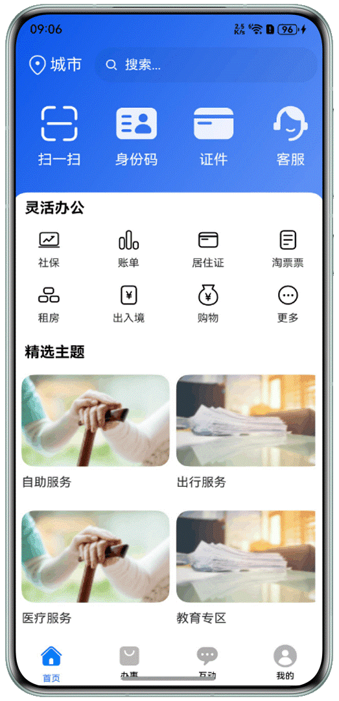

# 便捷生活类行业实践

## 介绍
本项目是面向“一卡通”、“政务云”等便捷生活类场景的 HarmonyOS 应用架构设计实践。应用采用模块化设计，旨在提供首页、办事大厅、个人中心、消息通知等核心功能，为智慧城市服务提供移动端解决方案。

主要功能包括：身份码展示、社保公积金查询、证件管理、居住证办理、办事预约以及基础的账户安全管理等。

## 效果预览


## 技术栈
* **开发框架**：HarmonyOS ArkUI
* **开发语言**：ArkTS
* **目标 SDK**：HarmonyOS 5.0.1 Release SDK
* **开发工具**：DevEco Studio 5.0.1 Release

## 功能模块
项目采用 Feature（功能模块）划分，主要包含以下子项目：
1.  **features/home (首页)**：提供扫一扫、身份识别、社保查询、居住证办理、二维码生成等常用功能入口。
2.  **features/office (办事)**：提供出行、养老、房产、就业等政务办事功能的页面框架。
3.  **features/mine (我的)**：包含用户登录、注册、账户安全、隐私设置、个人信息管理等用户侧功能。
4.  **features/message (消息)**：用于展示系统通知或消息列表。
5.  **features/RouterModule (路由)**：封装了统一的页面路由跳转逻辑，负责模块间的导航协调。

## 工程目录

```
├── common                        // 公共基础模块
│   ├── common                    // 通用组件与常量定义
│   └── network                   // 网络请求封装及WebView组件
├── entry                         // 应用主入口模块
│   └── src/main/ets              // 包含程序入口 EntryAbility 及主界面 Index
├── features                      // 业务功能模块
│   ├── home                      // 首页模块 (包含 UI 页面、ViewModel、工具类)
│   ├── message                   // 消息模块
│   ├── mine                      // 个人中心模块 (包含登录、注册、设置等组件)
│   ├── office                    // 办事模块
│   └── RouterModule              // 路由管理模块 (常量定义、工具类)
└── Screenshots                   // 预览截图
```

## 快速开始

### 环境准备
1.  下载并安装 **DevEco Studio 5.0.1 Release** 或更高版本。
2.  确保已安装 **HarmonyOS 5.0.1 Release SDK**。

### 运行步骤
1.  克隆或下载本仓库代码。
2.  使用 DevEco Studio 打开项目根目录下的 `oh-package.json5` 或工程目录。
3.  点击菜单栏的 **File > Sync and Refresh Project** 同步项目依赖。
4.  连接 HarmonyOS 5.0.1 及以上版本的华为手机设备，或使用本地模拟器。
5.  点击 **Run > Run 'entry'`** 编译运行应用。

## 注意事项
1.  **代码范围**：本仓库仅包含应用的部分框架代码，展示了核心架构和 UI 布局，具体的业务逻辑 API 需要开发者根据实际后端服务进行对接开发。
2.  **登录验证**：框架中提供的登录/注册页面仅为 UI 展示层。验证逻辑进行了简化（手机号位数正确即可登录），**请勿直接用于生产环境**，请务必根据真实的安全规范补全后端校验逻辑。