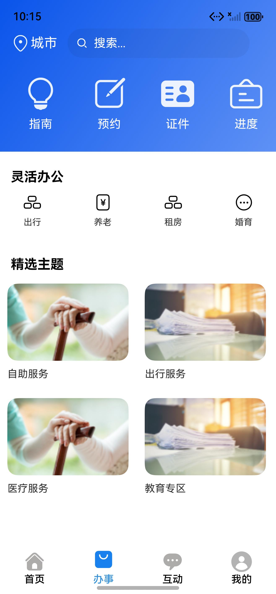
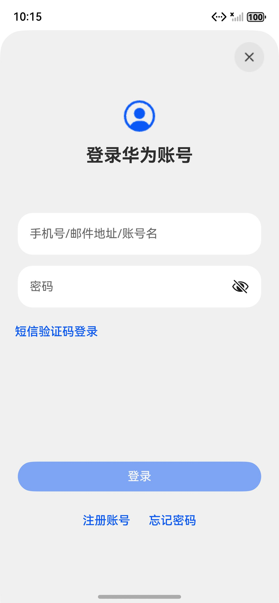

# A：应用框架交付与小组对接说明

## 1. 本次交付定位

A 的代码采用“在原源码上兼容式完善”的方式。现有四个 Tab、HAR 模块、路由常量和 `buildRouterModel(...)` 调用方式保持不变，B—F 可以继续开发自己的页面，不需要先做一次全量迁移。

本次已完成：

- `entry` 四 Tab 应用壳和统一 `Navigation` / `NavPathStack` 注册。
- 窗口顶部、底部安全区初始化、动态更新及监听注销。
- 路由栈缺失、路由名称错误、HAR 动态加载失败时的保护和日志。
- 页面 Builder 未注册时的可见错误页和返回操作，避免直接空指针崩溃。
- 公共 `PageStatus`、`AppError`、`PageStateView` 和 `AppStorageKeys`。
- 明确项目 `targetSdkVersion`，保持原来的 HarmonyOS 5.0.1（API 13），没有升级项目基线。
- 将 A 范围内三个模板 `abc` 测试替换成应用壳、公共错误和路由契约测试源码。
- 在本机模拟器完成 HAP 安装和启动，验证首页/办事/互动 Tab 切换、未登录跳转登录页及返回原 Tab。

## 2. 冻结的开发环境

| 项目 | 当前基线 |
|---|---|
| DevEco Studio | 6.0.0.878 |
| HarmonyOS SDK | 6.0.0 Release，API 20（本机安装） |
| 项目 compatible/target SDK | HarmonyOS 5.0.1，API 13 |
| Hvigor | 6.20.2 |
| ohpm | 5.3.2 |
| DevEco 内置 Node.js | 18.20.1 |

命令行构建时，`DEVECO_SDK_HOME` 应指向 SDK 根目录，而不是 `default` 子目录：

```powershell
$env:DEVECO_SDK_HOME='C:\Program Files\Huawei\DevEco Studio\sdk'
& 'C:\Program Files\Huawei\DevEco Studio\tools\hvigor\bin\hvigorw.bat' assembleHap --mode module -p product=default -p module=entry@default -p buildMode=debug --no-daemon
```

本次基线构建和改动后构建均为 `BUILD SUCCESSFUL`。通过 `hvigor taskTree` 确认并执行了各模块的 `test` 任务；A 范围共 6 个测试全部通过：`common` 2 个、`RouterModule` 3 个、`entry` 1 个，Failure 和 Error 均为 0。测试原始结果分别位于各模块 `.test/default/intermediates/test/coverage_data/test_result.txt`，HTML 报告位于 `.test/default/outputs/test/reports/index.html`。

## 3. B—F 如何接入

### 3.1 路由调用保持原写法

```ts
import { BuilderNameConstants, buildRouterModel, RouterNameConstants } from 'RouterModule';

buildRouterModel(
  RouterNameConstants.ENTRY_HAP,
  BuilderNameConstants.SocialSecurity
);
```

新代码如果需要知道跳转是否成功，可以使用返回的 Promise：

```ts
const success: boolean = await buildRouterModel(
  RouterNameConstants.ENTRY_HAP,
  BuilderNameConstants.WebPage,
  { url: 'https://example.com' }
);
```

旧代码忽略返回值仍然可以编译运行。

新增页面时按以下顺序对接：

1. 页面负责人先确定 Builder 名称和参数类型。
2. 把 Builder 名称交给 A，统一加入 `BuilderNameConstants`，不要在页面里散写字符串。
3. 页面所属模块在自己的 `Index.ets` / `harInit` 中增加动态导入。
4. 页面文件用 `wrapBuilder(...)` 和 `RouterModule.registerBuilder(...)` 注册。
5. 从入口页面实测“进入、返回、重复进入、错误参数”四条路径。

当前冻结路由：

| 所属模块 | Builder 常量 | 参数 |
|---|---|---|
| home / C | `SocialSecurity`、`ChequeSheet`、`ResidencePermit`、`RentingHouse`、`Credentials`、`Code` | 当前无必填参数 |
| mine / F | `LoginPage`、`RegisterPage`、`ForgetPassPage` | 当前无必填参数 |
| network / D | `WebPage` | `{ url: string }` |

### 3.2 公共页面状态

```ts
import { AppError, PageStatus, PageStateView } from 'common';

@State status: PageStatus = PageStatus.LOADING;
@State error: AppError = new AppError('', '', false);

PageStateView({
  status: this.status,
  message: this.error.message,
  onRetry: () => this.loadData()
})
```

`PageStateView` 只负责加载、空数据和错误提示；成功状态的业务 UI 仍由各成员自己的页面负责。

### 3.3 公共 AppStorage 键

新代码从 `common` 使用 `AppStorageKeys`，不要继续复制字符串：

- `TOP_SAFE_AREA`：顶部系统避让高度。
- `BOTTOM_SAFE_AREA`：底部导航指示器避让高度。
- `WINDOW_STAGE`：当前 WindowStage。
- `LOGIN_STATE`：保留原项目的 `login` 键，具体会话结构仍由 F 负责。

为兼容旧页面，这些常量的值仍是原来的 `topRectHeight`、`bottomRectHeight`、`windowStage` 和 `login`。

## 4. 当前已知警告和责任人

| 警告 | 当前影响 | 后续处理 |
|---|---|---|
| `@ohos/home` 等本地依赖名称与模块信息不一致 | 当前仍可打包 | A 与 B/E/F 在统一公开导出时集中迁移，不能单人改包名 |
| `common/network` 使用历史别名 `RouteModule` | 当前仍可打包 | D 修改网络模块时统一成公开依赖名，A 复测动态路由 |
| B—F 页面存在 `px2vp`、旧 Toast、旧 `getContext` 等废弃警告 | 不阻断当前编译 | 各成员在自己的目录内逐步处理 |
| 未配置团队签名 | 本机模拟器允许安装 unsigned HAP，真机发布条件仍未验证 | 最终真机联调前由 A 配置团队签名 |

## 5. A 的验收路径

1. 冷启动后依次切换首页、办事、互动三个 Tab。
2. 未登录点击“我的”，确认进入登录页并可返回。
3. 从首页进入至少一个民生详情页，确认进入、返回和再次进入正常。
4. 进入一个 ArkWeb 页面，确认 URL 参数正确且可返回。
5. 横竖屏或窗口尺寸变化后检查顶部、底部内容不被系统区域遮挡。
6. 人为传入不存在的路由栈或 Builder，确认只记录错误/显示错误页，不发生崩溃。

本次已在 `127.0.0.1:5555` 模拟器完成第 1、2 步中的主 Tab、登录跳转与返回验证。民生详情、ArkWeb、横竖屏/自由窗口、错误 Builder 可视页和真实设备签名安装仍未验证，后续联调不能省略。

## 6. 本次运行证据

以下截图均由本次构建的 HAP 在模拟器中实际运行后取得：








